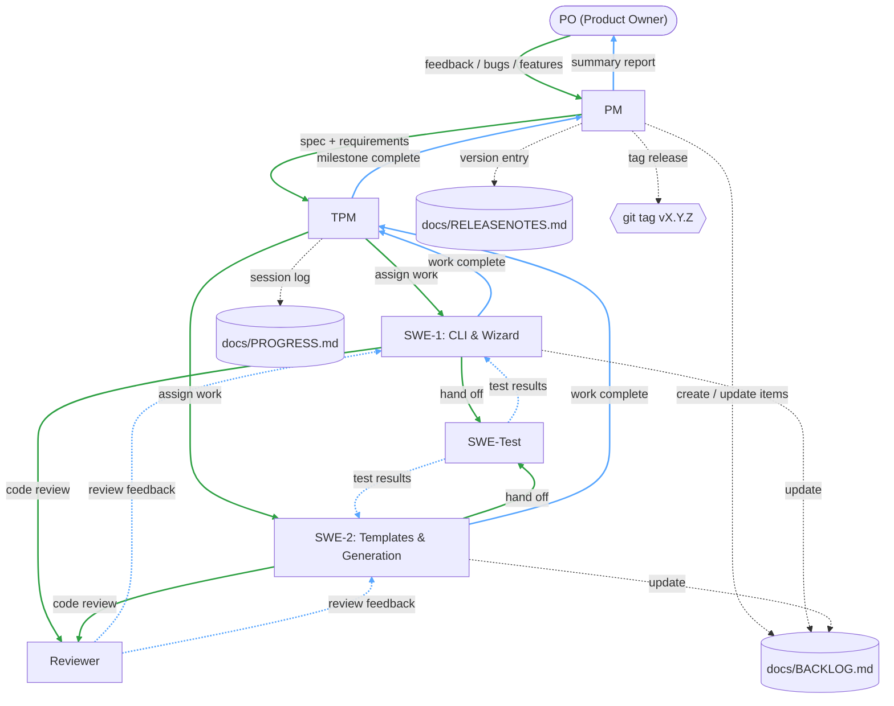

# Development Pipeline — appteam

> How features, bugs, and enhancements flow through the agent team.

## Legend

- **Green arrows** (`→`) — Downward flow: request → execution
- **Blue arrows** (`⇢`) — Upward flow: results → reporting
- **Gray dashed** — Side effects (docs updates, tagging, infra support)

## Pipeline Steps

1. **PO** provides feedback, bug reports, or feature requests to the **PM**
2. **PM** creates a product spec (`docs/specs/F-NNNN-slug.md`) and translates feedback into detailed requirements
3. **PM** works with **TPM** to create and prioritize items in docs/BACKLOG.md
4. **TPM** assigns individual work items to **SWE** agents
5. **SWE** agents implement on feature branches
6. **SWE-Test** runs automated tests to verify implementation
8. **Reviewer** conducts code review for quality, security, and performance
10. **SWE** agents update docs/BACKLOG.md and inform **TPM** when work is complete
11. **TPM** updates docs/PROGRESS.md with session details (what was done, decisions, next steps)
12. **TPM** waits for all milestone items to complete, then reports to **PM**
13. **PM** updates docs/RELEASENOTES.md with the new version entry (Added, Changed, Fixed)
14. **PM** creates a summary of completed work and reports back to the **PO**
15. **Tag release** — after PO approval, create annotated git tag (`git tag -a vX.Y.Z`) and push
